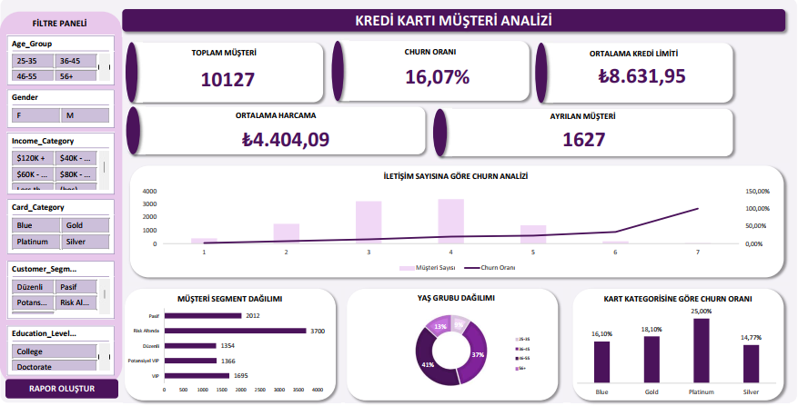

# Excel-Credit-Card-Customer-Analysis
Excel-based Credit Card Customer Analysis Dashboard with PivotTables, Solver, Scenario Analysis, VBA Automation and Interactive Reporting developed for Aktifbank Case Study.

## Prepared by

Hatice Gül Uzun

## Dashboard

## Project Overview

This project was developed for the Aktifbank Case Study using Microsoft Excel.

### Features

- Data Cleaning
- Lookup Tables
- Pivot Tables
- Pivot Charts
- Interactive Dashboard
- Sparklines
- Scenario Manager
- Goal Seek
- Two Variable Data Table
- Solver Optimization
- VBA Automation
- Automatic PDF & HTML Report Generation

---

## Project Files

- Hatice_Gul_Uzun_Case_Study_1.xlsm
- HaticeGulUzun_CaseStudy_1.docx
- HaticeGulUzun_CaseStudy_1.pptx
- Dashboard.pdf

---
